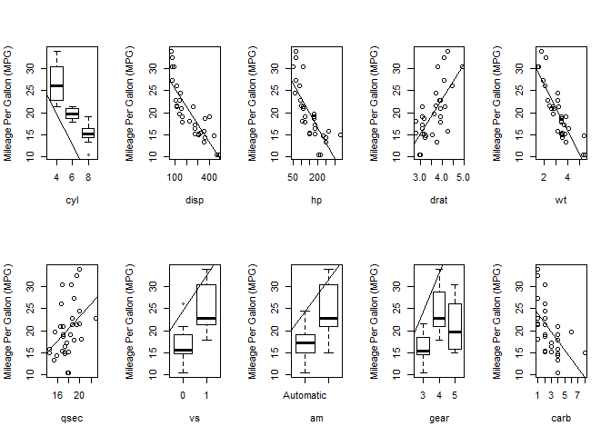
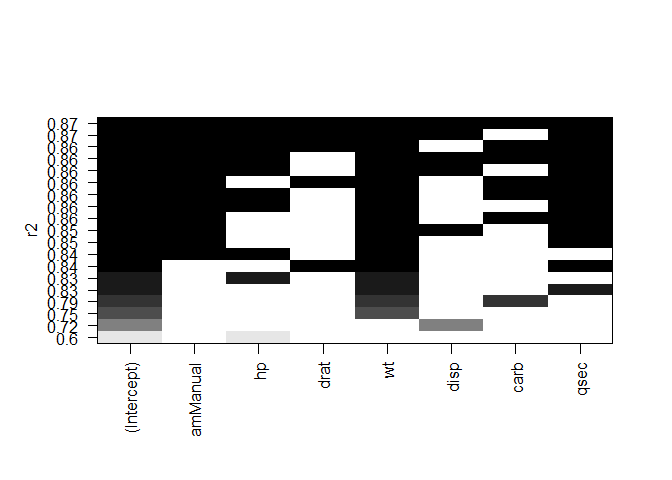
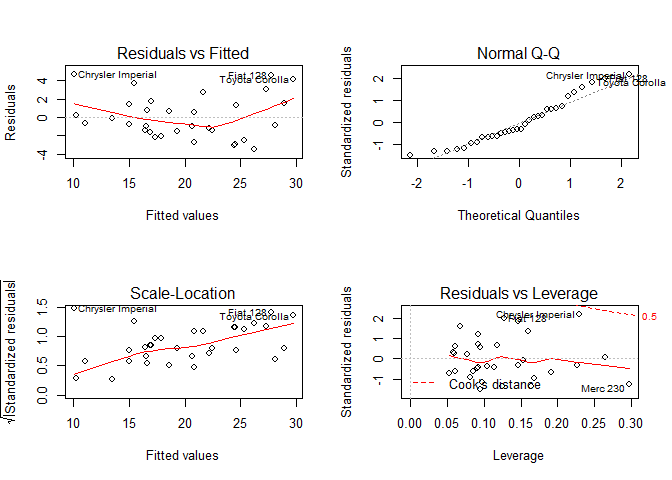
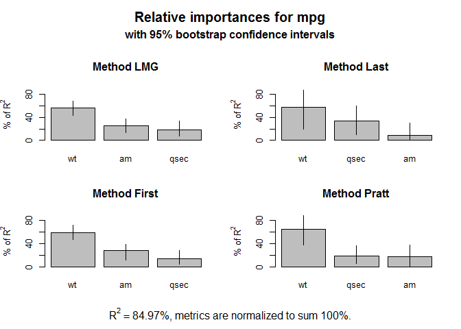

# Evaluation of impact of various factors(specially transmission) on MPG in Cars
Ritesh Kumar Malaiya  
Saturday, July 26, 2015  

# Evaluate Dataset


## FIT MODEL

1) Identify variables having Linear relationship with MPG

 

Based on above graph, we can observe that **cyl, hp, drat, wt, vs, am, disp, carb, qsec** variables seems to have a better linear relationship with mpg compared to others. 


### Identify Corelation

Let's try to observe the correlation between these variables (except cyl, am and vs, since these are categorical variable)

```
##         hp       drat         wt       disp       carb       qsec 
## -0.7761684  0.6811719 -0.8676594 -0.8475514 -0.5509251  0.4186840
```

At this point we have a fair idea how variables are correlated to mpg. (closer the correlation value to -1 or 1, better is the correlation)

### Fit a Linear Model

Here since, transmission is a factor variable we cannot efficiently fit linear model for mpg based on transmission only. Hence based on correlation score let's try to fit an initial model using cyl, hp, wt


```r
library(MASS)
lm_initial <- lm(mpg ~ am + hp + drat + wt + disp + carb + qsec, data = mtcars)
step <- stepAIC(lm_initial, direction="both")
```

Model recommendation by AIC


```r
step$anova # display results
```

```
## Stepwise Model Path 
## Analysis of Deviance Table
## 
## Initial Model:
## mpg ~ am + hp + drat + wt + disp + carb + qsec
## 
## Final Model:
## mpg ~ am + wt + qsec
## 
## 
##     Step Df  Deviance Resid. Df Resid. Dev      AIC
## 1                            24   149.9865 65.43390
## 2 - carb  1 0.1067476        25   150.0933 63.45667
## 3 - drat  1 3.3445512        26   153.4378 62.16190
## 4 - disp  1 6.6286537        27   160.0665 61.51530
## 5   - hp  1 9.2194693        28   169.2859 61.30730
```

Let's cross check the model using Leaps package


```r
library(leaps)
```

```r
leaps <- regsubsets(mpg ~ am + hp + drat + wt + disp + carb + qsec, data = mtcars, nbest = 3)
par(mfrow=c(1,1))
plot(leaps,scale="r2")
```

 

From above analysis, we can conclude that below should be the final model

```r
lm <- lm(mpg ~ am + wt + qsec, data = mtcars)
```


```
## 
## Call:
## lm(formula = mpg ~ am + wt + qsec, data = mtcars)
## 
## Residuals:
##     Min      1Q  Median      3Q     Max 
## -3.4811 -1.5555 -0.7257  1.4110  4.6610 
## 
## Coefficients:
##             Estimate Std. Error t value Pr(>|t|)    
## (Intercept)   9.6178     6.9596   1.382 0.177915    
## amManual      2.9358     1.4109   2.081 0.046716 *  
## wt           -3.9165     0.7112  -5.507 6.95e-06 ***
## qsec          1.2259     0.2887   4.247 0.000216 ***
## ---
## Signif. codes:  0 '***' 0.001 '**' 0.01 '*' 0.05 '.' 0.1 ' ' 1
## 
## Residual standard error: 2.459 on 28 degrees of freedom
## Multiple R-squared:  0.8497,	Adjusted R-squared:  0.8336 
## F-statistic: 52.75 on 3 and 28 DF,  p-value: 1.21e-11
```

 

### Check Relative Importance of the Model:

```r
library(relaimpo)

calc.relimp(lm,type=c("lmg","last","first","pratt"), rela=TRUE)
```


```r
boot <- boot.relimp(lm, b = 1000, type = c("lmg", "last", "first", "pratt"), rank = TRUE, diff = TRUE, rela = TRUE)
# booteval.relimp(boot) # print result
```


```r
plot(booteval.relimp(boot,sort=TRUE)) # plot result
```

 

we can also verify our model using chi square test whose value = ***1***. To cross check whether this can be a case of overfitting. Let's try to drop a variable


```r
drop1(lm, test="Chisq")
```

```
## Single term deletions
## 
## Model:
## mpg ~ am + wt + qsec
##        Df Sum of Sq    RSS    AIC  Pr(>Chi)    
## <none>              169.29 61.307              
## am      1    26.178 195.46 63.908   0.03195 *  
## wt      1   183.347 352.63 82.790 1.260e-06 ***
## qsec    1   109.034 278.32 75.217 6.643e-05 ***
## ---
## Signif. codes:  0 '***' 0.001 '**' 0.01 '*' 0.05 '.' 0.1 ' ' 1
```
As we can see, we do not require to drop any variable.


## Coefficients as per the model

I guess now we can safely assume that below are the coef of this model


```r
lm$coef
```

```
## (Intercept)    amManual          wt        qsec 
##    9.617781    2.935837   -3.916504    1.225886
```


# Questions of Interest

- **Is an automatic or manual transmission better for MPG**
From above coefficients we can understand that ***Manual Transmission is better*** than Automatic Transmission.


- **Quantify the MPG difference between automatic and manual transmissions**
If we keep weight and qsec constant (mean) then extra milega that will be provided by Manual Transmission as compared to Automatic is 2.9358372. However, for every increase in weight by single unit gain in mileage is 8.637114 and for every increase in qsec gain in mileage is 13.7795037 more than Automatic Transmission.

# Executive Summary
For a Car having same weigth Manual Transamission gives better mileage than Automatic Transmission. Also, for every increase in weight and / or qsec, corresponding increase in Manual transmission is in range of > 2.9358372 and < 9.863

