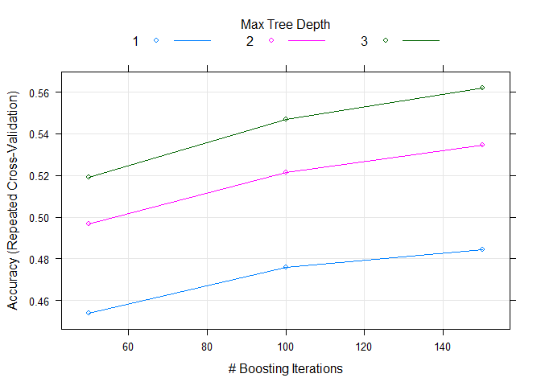

# Human Activity Recognition
Ritesh Kumar Malaiya  
August 18, 2015  


# Read Data

Let's read the csv training data - pml-training.csv. This will be sub divided into training and test sets using cross validation.After a model is trained and tested on this dataset we will apply the model on the pml-testing.csv file provided.


```r
pml <- read.csv("pml-training.csv")
pmlTrain <- pml
```

# Exploratory Data Analysis

## Check Dimension of Data

```r
dim(pmlTrain)
```

```
## [1] 19622   160
```

## Check all possible classes

```r
unique(pmlTrain$classe)
```

```
## [1] A B C D E
## Levels: A B C D E
```

## Variables format conversion

1. Let's find out variables which may have been wrongly identified as factor/character but are actually numeric variables

```r
pmlTrain_class <- sapply(pmlTrain, class)
non_integer_columns <- names(pmlTrain[, which(pmlTrain_class != 'integer' & pmlTrain_class != 'numeric')])
non_integer_columns
```

```
##  [1] "user_name"               "cvtd_timestamp"         
##  [3] "new_window"              "kurtosis_roll_belt"     
##  [5] "kurtosis_picth_belt"     "kurtosis_yaw_belt"      
##  [7] "skewness_roll_belt"      "skewness_roll_belt.1"   
##  [9] "skewness_yaw_belt"       "max_yaw_belt"           
## [11] "min_yaw_belt"            "amplitude_yaw_belt"     
## [13] "kurtosis_roll_arm"       "kurtosis_picth_arm"     
## [15] "kurtosis_yaw_arm"        "skewness_roll_arm"      
## [17] "skewness_pitch_arm"      "skewness_yaw_arm"       
## [19] "kurtosis_roll_dumbbell"  "kurtosis_picth_dumbbell"
## [21] "kurtosis_yaw_dumbbell"   "skewness_roll_dumbbell" 
## [23] "skewness_pitch_dumbbell" "skewness_yaw_dumbbell"  
## [25] "max_yaw_dumbbell"        "min_yaw_dumbbell"       
## [27] "amplitude_yaw_dumbbell"  "kurtosis_roll_forearm"  
## [29] "kurtosis_picth_forearm"  "kurtosis_yaw_forearm"   
## [31] "skewness_roll_forearm"   "skewness_pitch_forearm" 
## [33] "skewness_yaw_forearm"    "max_yaw_forearm"        
## [35] "min_yaw_forearm"         "amplitude_yaw_forearm"  
## [37] "classe"
```

* Let's check the data present for these columns

```r
head(pmlTrain[complete.cases(pmlTrain[, non_integer_columns]), non_integer_columns])
```

```
##   user_name   cvtd_timestamp new_window kurtosis_roll_belt
## 1  carlitos 05/12/2011 11:23         no                   
## 2  carlitos 05/12/2011 11:23         no                   
## 3  carlitos 05/12/2011 11:23         no                   
## 4  carlitos 05/12/2011 11:23         no                   
## 5  carlitos 05/12/2011 11:23         no                   
## 6  carlitos 05/12/2011 11:23         no                   
##   kurtosis_picth_belt kurtosis_yaw_belt skewness_roll_belt
## 1                                                         
## 2                                                         
## 3                                                         
## 4                                                         
## 5                                                         
## 6                                                         
##   skewness_roll_belt.1 skewness_yaw_belt max_yaw_belt min_yaw_belt
## 1                                                                 
## 2                                                                 
## 3                                                                 
## 4                                                                 
## 5                                                                 
## 6                                                                 
##   amplitude_yaw_belt kurtosis_roll_arm kurtosis_picth_arm kurtosis_yaw_arm
## 1                                                                         
## 2                                                                         
## 3                                                                         
## 4                                                                         
## 5                                                                         
## 6                                                                         
##   skewness_roll_arm skewness_pitch_arm skewness_yaw_arm
## 1                                                      
## 2                                                      
## 3                                                      
## 4                                                      
## 5                                                      
## 6                                                      
##   kurtosis_roll_dumbbell kurtosis_picth_dumbbell kurtosis_yaw_dumbbell
## 1                                                                     
## 2                                                                     
## 3                                                                     
## 4                                                                     
## 5                                                                     
## 6                                                                     
##   skewness_roll_dumbbell skewness_pitch_dumbbell skewness_yaw_dumbbell
## 1                                                                     
## 2                                                                     
## 3                                                                     
## 4                                                                     
## 5                                                                     
## 6                                                                     
##   max_yaw_dumbbell min_yaw_dumbbell amplitude_yaw_dumbbell
## 1                                                         
## 2                                                         
## 3                                                         
## 4                                                         
## 5                                                         
## 6                                                         
##   kurtosis_roll_forearm kurtosis_picth_forearm kurtosis_yaw_forearm
## 1                                                                  
## 2                                                                  
## 3                                                                  
## 4                                                                  
## 5                                                                  
## 6                                                                  
##   skewness_roll_forearm skewness_pitch_forearm skewness_yaw_forearm
## 1                                                                  
## 2                                                                  
## 3                                                                  
## 4                                                                  
## 5                                                                  
## 6                                                                  
##   max_yaw_forearm min_yaw_forearm amplitude_yaw_forearm classe
## 1                                                            A
## 2                                                            A
## 3                                                            A
## 4                                                            A
## 5                                                            A
## 6                                                            A
```
* First look in the name list we can identify that user_name,cvtd_timestamp, new_window, classe variables cannot be converted to numeric data

```r
pmlTrain <- pmlTrain[, !names(pmlTrain) %in% c("user_name", "new_window" ,"classe", "cvtd_timestamp") ]
```

* For rest variables let's convert them to numeric variables


```r
pmlTrain <- data.frame(sapply(pmlTrain, as.numeric)) 
pmlTrain$new_window <- pml$new_window
```


# Preprocessing of Data

## Column-wise Preprocessing

### Dummy Data
Per data analysis done above, we now know that new_window variable is a factor variable and need preprocessing.


```r
d <- dummyVars(~new_window, data = pmlTrain)
temp <- data.frame(predict(d, pmlTrain))

pmlTrain$new_window.no <- temp$new_window.no
pmlTrain$new_window.yes <- temp$new_window.yes

pmlTrain <- pmlTrain[, !names(pmlTrain) %in% c("new_window") ]
```

### Near Zero Variables

```r
nzr <- nearZeroVar(pmlTrain, saveMetrics = T)
```

Per Near Zero Variance test, we should filter below features from the data

```r
row.names(nzr[nzr$nzv == T,])
```

```
##  [1] "kurtosis_roll_belt"      "kurtosis_picth_belt"    
##  [3] "kurtosis_yaw_belt"       "skewness_roll_belt"     
##  [5] "skewness_roll_belt.1"    "skewness_yaw_belt"      
##  [7] "max_yaw_belt"            "min_yaw_belt"           
##  [9] "amplitude_yaw_belt"      "avg_roll_arm"           
## [11] "stddev_roll_arm"         "var_roll_arm"           
## [13] "avg_pitch_arm"           "stddev_pitch_arm"       
## [15] "var_pitch_arm"           "avg_yaw_arm"            
## [17] "stddev_yaw_arm"          "var_yaw_arm"            
## [19] "kurtosis_roll_arm"       "kurtosis_picth_arm"     
## [21] "kurtosis_yaw_arm"        "skewness_roll_arm"      
## [23] "skewness_pitch_arm"      "skewness_yaw_arm"       
## [25] "max_roll_arm"            "min_roll_arm"           
## [27] "min_pitch_arm"           "amplitude_roll_arm"     
## [29] "amplitude_pitch_arm"     "kurtosis_roll_dumbbell" 
## [31] "kurtosis_picth_dumbbell" "kurtosis_yaw_dumbbell"  
## [33] "skewness_roll_dumbbell"  "skewness_pitch_dumbbell"
## [35] "skewness_yaw_dumbbell"   "max_yaw_dumbbell"       
## [37] "min_yaw_dumbbell"        "amplitude_yaw_dumbbell" 
## [39] "kurtosis_roll_forearm"   "kurtosis_picth_forearm" 
## [41] "kurtosis_yaw_forearm"    "skewness_roll_forearm"  
## [43] "skewness_pitch_forearm"  "skewness_yaw_forearm"   
## [45] "max_roll_forearm"        "max_yaw_forearm"        
## [47] "min_roll_forearm"        "min_yaw_forearm"        
## [49] "amplitude_roll_forearm"  "amplitude_yaw_forearm"  
## [51] "avg_roll_forearm"        "stddev_roll_forearm"    
## [53] "var_roll_forearm"        "avg_pitch_forearm"      
## [55] "stddev_pitch_forearm"    "var_pitch_forearm"      
## [57] "avg_yaw_forearm"         "stddev_yaw_forearm"     
## [59] "var_yaw_forearm"         "new_window.no"          
## [61] "new_window.yes"
```

```r
nzr <- nearZeroVar(pmlTrain)
pmlTrain <- pmlTrain[,-nzr]
```

### Find Corelation

```r
highlyCor <- findCorrelation(pmlTrain, exact = F)
pmlTrain <- pmlTrain[ , - highlyCor[complete.cases(highlyCor)]]
```


## Row-wise Preprocessing
### Impute

```r
preObj <- preProcess(x = pmlTrain, method = c("knnImpute"))
pmlTrain <- data.frame(predict(preObj, pmlTrain))
```

### Principal Component Analysis

```r
preObj <- preProcess(x = pmlTrain, method = c("pca"))
pmlTrain <- data.frame(predict(preObj, pmlTrain))
```

### Split Data into Training & Test Set

```r
pmlTrain$classe <- pml$classe

inTrain <- createDataPartition(y = pmlTrain$classe, p = .7, list = F)
pmlTrain_rel<- pmlTrain[inTrain,]
pmlTest<- pmlTrain[-inTrain,]
```


# Train a model

## Define Train control

```r
registerDoParallel(cores=4)
control <- trainControl(method="repeatedcv", number=2, repeats=2)
```

## Train and Plot a model

```r
model <- train(classe~., data=pmlTrain_rel, method="gbm", trControl=control)
```

```
## Iter   TrainDeviance   ValidDeviance   StepSize   Improve
##      1        1.6094             nan     0.1000    0.0868
##      2        1.5544             nan     0.1000    0.0607
##      3        1.5156             nan     0.1000    0.0459
##      4        1.4862             nan     0.1000    0.0361
##      5        1.4624             nan     0.1000    0.0282
##      6        1.4432             nan     0.1000    0.0283
##      7        1.4232             nan     0.1000    0.0234
##      8        1.4074             nan     0.1000    0.0185
##      9        1.3939             nan     0.1000    0.0192
##     10        1.3809             nan     0.1000    0.0151
##     20        1.2900             nan     0.1000    0.0080
##     40        1.2011             nan     0.1000    0.0028
##     60        1.1459             nan     0.1000    0.0023
##     80        1.1027             nan     0.1000    0.0002
##    100        1.0681             nan     0.1000    0.0007
##    120        1.0377             nan     0.1000    0.0006
##    140        1.0097             nan     0.1000    0.0008
##    150        0.9970             nan     0.1000   -0.0002
```

```r
plot(model)
```

 

## Prediction

```r
pmlTrain_predict <- predict(model, newdata = pmlTest)
cnfM <- confusionMatrix(pmlTest$classe, pmlTrain_predict)
cnfM
```

```
## Confusion Matrix and Statistics
## 
##           Reference
## Prediction    A    B    C    D    E
##          A 1180  145  209   98   42
##          B  188  647  157   66   81
##          C  324  102  458  101   41
##          D  300   63  161  366   74
##          E  104  146   85   44  703
## 
## Overall Statistics
##                                           
##                Accuracy : 0.5699          
##                  95% CI : (0.5572, 0.5826)
##     No Information Rate : 0.3562          
##     P-Value [Acc > NIR] : < 2.2e-16       
##                                           
##                   Kappa : 0.4504          
##  Mcnemar's Test P-Value : < 2.2e-16       
## 
## Statistics by Class:
## 
##                      Class: A Class: B Class: C Class: D Class: E
## Sensitivity            0.5630   0.5866  0.42804  0.54222   0.7471
## Specificity            0.8696   0.8971  0.88204  0.88522   0.9233
## Pos Pred Value         0.7049   0.5680  0.44639  0.37967   0.6497
## Neg Pred Value         0.7825   0.9039  0.87405  0.93721   0.9504
## Prevalence             0.3562   0.1874  0.18182  0.11470   0.1599
## Detection Rate         0.2005   0.1099  0.07782  0.06219   0.1195
## Detection Prevalence   0.2845   0.1935  0.17434  0.16381   0.1839
## Balanced Accuracy      0.7163   0.7418  0.65504  0.71372   0.8352
```

Based on the confusion matrix above, we can see that the Accuracy of model is 55%.
